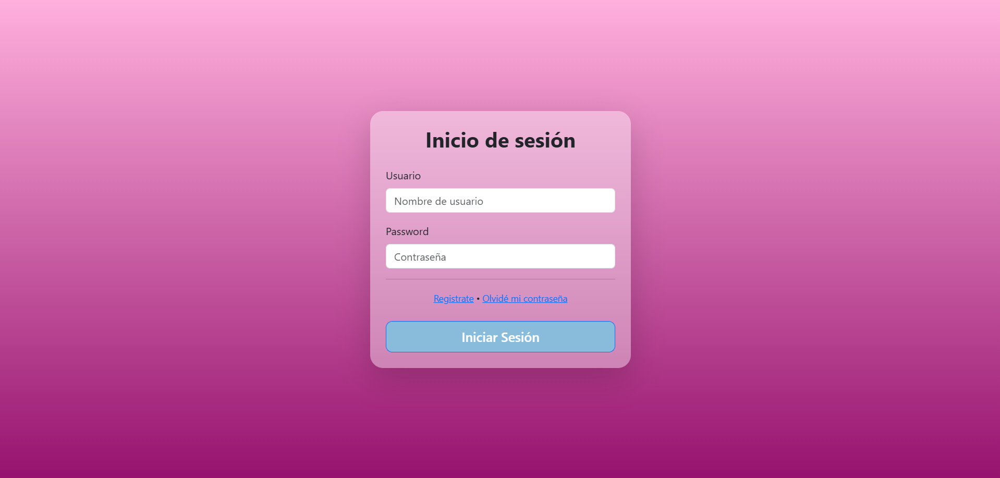
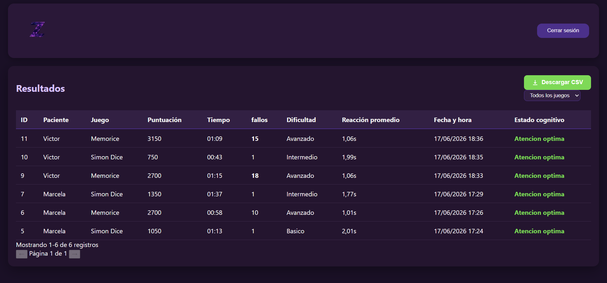
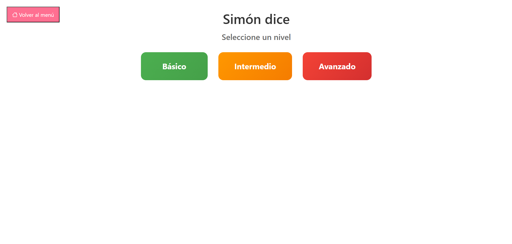
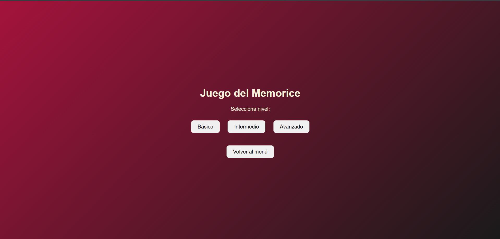
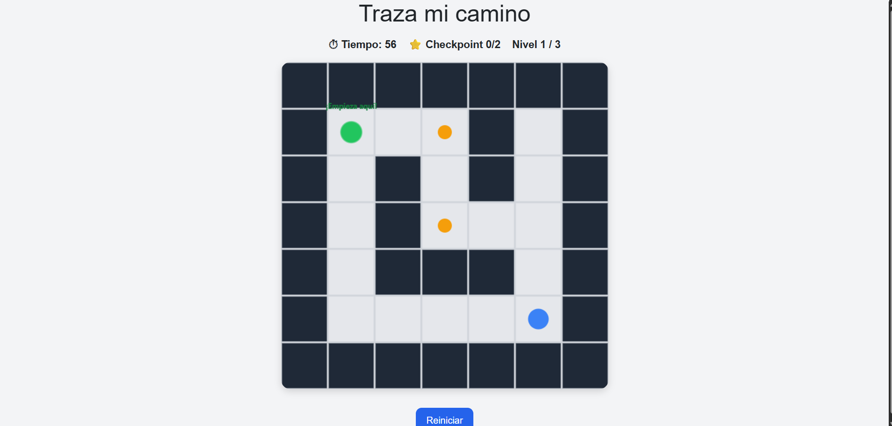

# Z-STARS AI 


**Plataforma web de evaluación cognitiva con análisis predictivo en tiempo real**
Z-STARS AI es una aplicación web orientada a la evaluación de funciones ejecutivas (memoria de trabajo, atención sostenida y control inhibitorio) mediante minijuegos interactivos.
El sistema registra eventos en tiempo real, los procesa en backend y genera una clasificación automática del rendimiento cognitivo del usuario mediante Machine Learning.

## Demo
- Url: https://zstars-ai.com/

## Problemas que resuelve 
Las evaluaciones cognitivas tradicionales presentan desafíos como:
- Poco interactiva 
- Difícil de estandarizar
- Lenta en la obtención de resultados
Z-STARS AI propone un enfoque digital gamificado que permite:
- Capturar métricas conductuales en tiempo real
- Automatizar análisis de rendimiento
- Visualizar evolución del usuario clínico 

## Arquitectura del sistema 
1. El usuario interactúa con minijuegos en el frontend
2. Eventos son enviados asíncronamente al backend (HTTP)
3. Django procesa y almacena métricas en base de datos
4. Un modelo de Machine Learning clasifica el rendimiento
5. Los resultados se visualizan en un dashboard clínico

## Métricas capturadas
- Tiempos de reacción
- Tasa de errores
- Duración de sesión 
- Nivel de dificultad alcanzado

## Stack técnico
**Backend**
- Python 3.12.7
- Django
- Django REST Framework
- PostgreSQL
- Docker
**Frontend**
- Javascript (async event tracking)
- Bootstrap
- Chart.js
**Machine Learning**
- Scikit-learn
- Random Forest classifier
**Infraestructura**
- Cloudflare
- Render
- Resend
**AI**
- [Groq](https://groq.com/)

## Machine Learning pipeline
El sistema utiliza un modelo de clasificación basado en Random Forest para estimar el estado de rendimiento cognitivo del usuario.
**Features de entrada:**
- Puntaje
- Errores
- Tiempo total
- Tiempo de reacción
- Dificultad
**Output:**
- Clasificación del rendimiento (Estable/Mejora/Deterioro)
> El modelo se ejecuta en tiempo de request del Backend Django.

## Arquitectura técnica
Este proyecto implementa:
- Event-driven tracking en frontend (Captura de comportamiento en tiempo real)
- Backend centrado en Django para agregación de eventos
- Pipeline del ML embebido en request lifecycle
- Dashboard analítico basado en series temporales
- Diseño monolítico modular con separación por apps

## API Endpoints
**Core**
- GET / -> login
- GET /dashboard/ -> panel clínico
- GET /memorice/ -> juego memorice
- GET /simon_dice/ -> juego de simon dice
- GET /maze/ -> juego de recorrido
- GET /menu_juegos -> selección de ejercicios
- GET /logout -> cierre de sesión
**API**
- POST /puntos/ -> registro de sesión + ejecución ML
- POST /api/analizar/ -> análisis con modelo LLM

## Características principales
- Registro de métricas cognitivas en tiempo real
- Gamificación de pruebas neuropsicológicas
- Clasificación automática con ML
- Dashboard de evolución del usuario
- Visualización de series temporales con Chart.js
- Sistema de automatización en sesiones Django

## Capturas








## Juegos
- Memorice (Niveles de dificultad)
- Simon dice (estado progresivo de cartas)
- Traza mi camino 

## Diseño UI/UX
Figma:
[Figma Design System](https://www.figma.com/design/toq6iZzf5nAo4pHuaAxr9K/Z-STARS-AI---project?node-id=0-1&t=4tem9TwkkyUhzmkG-1)

## Estructura del proyecto 
```bash
Z-STARS AI/
├── core/
├── games/
│   ├── ml/
│   ├── templates/
│   ├── static/
│   ├── models.py
│   ├── views.py
├── manage.py
├── requirements.txt
└── runtime.txt
```
## Autenticación 
Sistema basado en sesiones de Django para control de acceso al dashboard y registros clínicos.

## Desafios técnicos
Durante el desarrollo se abordaron desafíos como:
- Captura de métricas en tiempo real desde minijuegos interactivos.
- Persistencia de eventos sin afectar al experiencia del usuario.
- Integración de un modelo de Machine Learning dentro del flujo de evaluación.
- Visualización histórica de métricas cognitivas mediante dashboard interactivos.

## Decisiones de ingeniería
- Se priorizó arquitectura monolítica modular por simplicidad de despliegue
- ML integrado en el backend para reducir complejidad de infraestructura
- Captura de eventos en frontend sin websocket (tradeoff: simplicidad vs latencia)
- SQLite usado para el desarrollo local y PostgreSQL para producción

## Roadmap 
- [ ] JWT
- [ ] Asistente virtual IA
- [ ] batching / async queue

## Estado del proyecto
- Plataforma desplegada en producción
- Dominio propio configurado
- Base de datos PostgreSQL persistente
- Infraestructura gestionada mediante Render y Cloudflare

# Autores
- Sofía Cartagena
Fullstack Developer - [GitHub](https://github.com/socartagena02)
