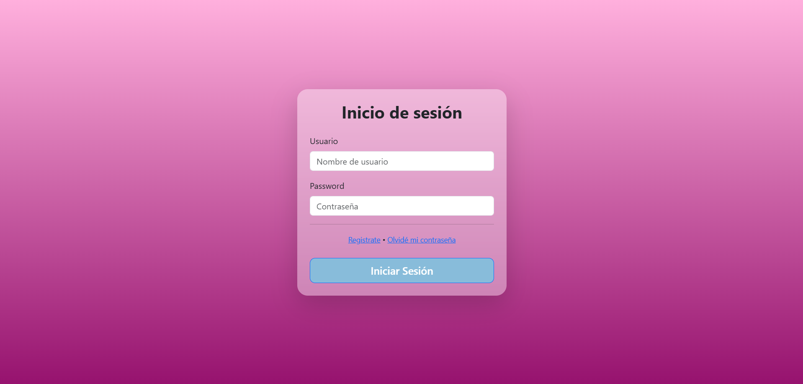
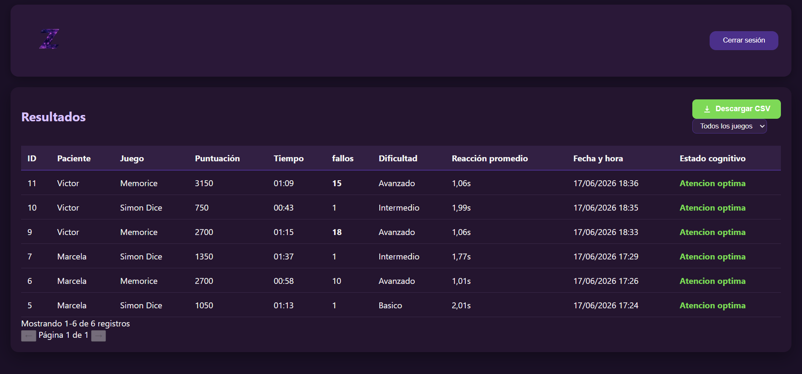

# Z-STARS AI 


**Cognitive assessment platform for occupational therapy.**

Z-STARS AI is a production-ready web application designed to support occupational therapists in assessing executive functions through interactive mini-games. The platform captures behavioral metrics in real time, processes them on the backend, and uses machine learning to estimate the user's cognitive performance.

🌐 **Live Demo:** <https://zstars-ai.com>

## Why this project?

Z-STARS AI began as my Computer Engineering capstone project. Rather than treating it as a one-time academic assignment, I continued developing it into a production-ready application by improving its architecture, integrating machine learning features, deploying it to the cloud, and maintaining it as an active personal project.

## Highlights
- Production deployment with a custom domain.
- achine learning integration using Random Forest.
- Real-time cognitive performance dashboard.
- Dockerized deployment.
- Hosted on Render with Cloudflare.

## Key Features
- Interactive cognitive assessment games.
- Real-time behavioral data collection.
- machine learning-based cognitive performance classification.
- Clinical dashboard with historical progress tracking.
- AI-assisted cognitive analysis.
- Production deployment with Docker and Render.

## Problem

Traditional cognitive assessments often present several challenges:

- Manual evaluation processes.
- Limited interactivity.
- Slow result generation.
- Difficult longitudinal tracking.

Z-STARS AI digitizes this workflow by providing therapists with an interactive platform capable of collecting objective behavioral metrics and generating automatic performance insights.

## System Architecture

```
┌───────────────┐
│    Browser    │
└──────┬────────┘
       │
       ▼
JavaScript Frontend
       │ REST API
       ▼
Django REST Framework
       │
 ┌─────┴──────────────┐
 │                    │
 ▼                    ▼
PostgreSQL        ML Pipeline
                      │
                      ▼
                Groq AI Service 
                      │
                      ▼
            Cognitive Prediction
```

## Technology Stack 
| Layer | Technologies |
|--------|--------------|
| Backend | Python 3.12, Django, Django REST Framework |
| Frontend | JavaScript, Bootstrap, Chart.js |
| Database | PostgreSQL |
| Machine Learning | Scikit-learn, Random Forest |
| Infrastructure | Docker, Render, Cloudflare |
| AI  | Groq API|
| Email  | Resend |

## Machine Learning Pipeline
The platform includes a Random Forest classifier trained on gameplay behavioral metrics.

The model analyzes user interaction data collected during cognitive exercises and generates an immediate performance classification that is displayed on the clinical dashboard.

## Input Features
- Score
- Reaction time
- Total session duration
- Number of errors
- Difficulty level

## Prediction
The model classifies cognitive performance into one of three categories:
- Stable
- Improvement
- Decline

The prediction is executed during the session processing workflow and immediately reflected in the clinical dashboard.

## REST API
### Core Routes
| Method | Endpoint | Description |
|---------|----------|-------------|
| GET | / | Home |
| GET | /login | Login |
| GET | /dashboard | Clinical dashboard |
| GET | /memorice | Memory game |
| GET | /simon_dice | Simon Says |
| GET | /maze | Maze game |
| GET | /menu_juegos | Game selection |
| GET | /logout | Logout |

### API
| Method | Endpoint | Description |
|---------|----------|-------------|
| POST | /puntos | Stores session metrics and executes ML classification |
| POST | /api/analizar | AI-powered cognitive analysis |

## Engineering Decisions
This project follows a modular monolithic architecture.

Key design decisions include:

- Modular Django application structure.
- Embedded ML pipeline to reduce infrastructure complexity.
- Event-driven behavioral tracking on the frontend.
- PostgreSQL in production and SQLite for local development.
- Docker-based deployment.
- Cloudflare DNS and Render hosting.

## Project Structure
```
Z-STARS-AI/
├── core/
├── games/
│   ├── ml/
│   ├── templates/
│   ├── static/
│   ├── models.py
│   └── views.py
├── manage.py
├── requirements.txt
└── runtime.txt
```

## Screenshots
### Login

### Clinical Dashboard

### Cognitive Games


## Installation
```bash
git clone https://github.com/socartagena02/Z-STARS-AI.git
cd Z-STARS-AI

python -m venv venv

# Windows
venv\Scripts\activate

# Linux / macOS
source venv/bin/activate

pip install -r requirements.txt

python manage.py migrate

python manage.py runserver
```

## Future Improvements
- JWT authentication
- AI virtual assistant
- Background task queue (Celery)
- CI/CD pipeline with GitHub Actions

## Author
**Sofía Cartagena**
[GitHub](https://github.com/socartagena02) 